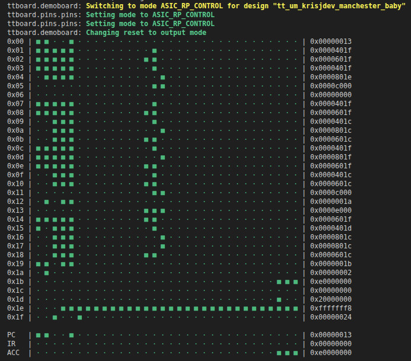
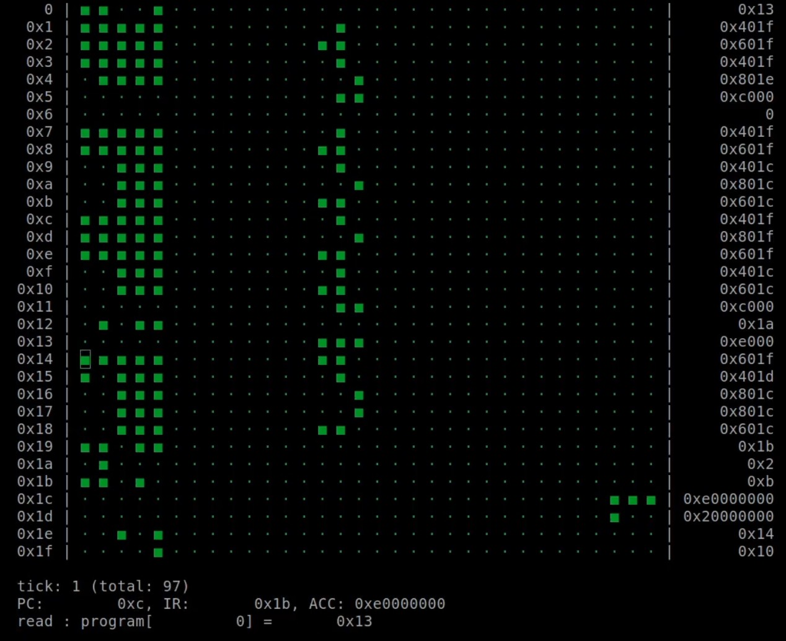
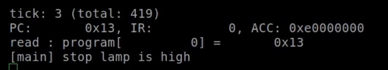

<!---

This file is used to generate your project datasheet. Please fill in the information below and delete any unused
sections.

You can also include images in this folder and reference them in the markdown. Each image must be less than
512 kb in size, and the combined size of all images must be less than 1 MB.
-->

## History of the Manchester Baby

The Manchester Baby, also known as the Small-Scale Experimental Machine, is a historically significant computer for being the first to execute electronically-stored programs. It uses 32-bit words, can access 32 unique memory addresses and execute 7 different instructions. A quirk of its implementation is that it negates a value when it is being loaded, therefore using a subtractor instead of an adder.

### Instruction Set

| Number | Mnemonic | Operation |
| :- | :- | :- |
| 0 | JMP | Copy content of specified line into the program counter |
| 1 | JRP | Add content of specified line to the program counter | 
| 2 | LDN | Negate and load content of specified line into the accumulator |
| 3 | STO | Store the content of the accumulator to the specified memory address |
| 4 | SUB | Subtract the content of the specified line from the accumulator |
| 5 | SUB | As above |
| 6 | CMP | If the accumulator is less than 0, increment program counter |
| 7 | STP | Halt the Baby and light the stop lamp |

## Interfacing with the Baby

There are two methods to interface with the Baby:
- via the Tiny Tapeout devkit
- via an external module/microcontroller

I recommend using the devkit as that already has everything wired up for you.

### Using the Devkit

You'll need to plug your devkit into your computer and clone the project repo (https://github.com/diy-ic/tt-manchester-baby).

Within the project repo, there are some micropython scripts which you can run on your devkit.

- `/test/etr` contains a microcotb testbench which can be used to verify if everything is functional
- `/tools` contains a runner script that allows you to load your own programs

If you're using the FPGA breakout board, you'll have to compile the bitstream yourself - see how at
https://tinytapeout.com/guides/fpga-breakout/

For the next steps, see the "How to test" section.

### Using an external microcontroller

I've written an example C++ program that can be run on a Pico to interface with the Baby: https://github.com/krisjdev/pico-baby-if/

Other microcontrollers can be used, but you would have to adjust the code slightly as it uses Pico SDK functions.

The Pico acts as the RAM module for the Baby, since there isn't one present on the tile for this project. It uses nearly every single GPIO pin in order to provide the Baby with data input, output and control lines to make it function. The pre-defined pins can be found in ``babyif/pindefs.h`` in the aforementioned GitHub repo.

### Connectivity

Due to pin limitations, there was a need to serialise the I/O of the Baby in some form as there weren't enough to expose a 32-bit interface. Therefore, this design also contains two modules (effectively shift registers) which will either accept 4x 8-bit inputs and show them to the Baby as one 32-bit value (PTP_A) or allow you to shift out 160 bits as multiple 8-bit segments (PTP_B) in order to get information about RAM access or the state of the program counter, instruction register or accumulator. Please note that PTP_B is read only, so the program counter, instruction register or accumulator cannot be directly modified.

## How to test

### Using the Devkit

Navigate into either the `/test/etr` or `/tools` folder of the project repo and mount it remotely with `mpremote mount .`. 
This will make it so the contents of the folder appear on the microcontroller's virtual file system at `/remote`. You
should have been dropped into a REPL, so now we can import and run some scripts.

If you mounted `/test/etr`, run `import test; test.main()`. You should see something like the following:
```text
Manchester Baby: enabled project, beginning tests
runner: *** Running Test 1/3: test_ptp_wide ***
runner: *** Test 'test_ptp_wide' PASS ***
runner: No clocks in test
runner: *** Running Test 2/3: test_ptp_narrow ***
runner: *** Test 'test_ptp_narrow' PASS ***
runner: No clocks in test
runner: *** Running Test 3/3: run_test_prog ***
[...]
```

If you mounted `/tools`, run `import execute; execute.main()`. This will clear the console and render a live view of
the memory contents.



When the stop lamp goes high, the Baby will stop executing and you can inspect the memory contents for your answer. For
this sample program, the answer is `0xe0000000` at address `0x1c`.

You can add additional programs by editing `/tools/programs.py`, and then updating the runner to use it inside `/tools/execute.py`.

### Using an external microcontroller

If using the interface provided at https://github.com/krisjdev/pico-baby-if/, you will have to wire up the chip yourself -
pay attention to the pre-defined pins as specified in `babyif/pindefs.h`. Once flashed, it will automatically begin
executing a Turing Long Division program, found in ``program.c``.

Note: I have only attempted this on my own FPGA without any of the Tiny Tapeout infrastructure in the way. The program
needs to be adapted in order to select and enable the project.



You can disable the CRT-esque display by commenting out ``draw_crt();`` at the very beginning of the ``while(true)`` loop.

Once the program finishes executing, a message will appear that the stop lamp has gone high.



In the case of the given Turing Long Division program the answer should be ``0xe0000000`` at address ``0x1c``.

If you want to execute your own programs, simply modify the program array in  ``program.c``, compile and upload to the RP2040/Pico.

### Compiling your own programs

You can find an example program and compiler at https://gitlab.com/charles.fox/comparch/-/tree/main/chapter07, or try using ``babyutils`` from https://github.com/andy-bower/babyutils.


## External hardware

The official devkit is the best suited for this, although it's possible with a regular Rapsberry Pi Pico. Any
microcontroller with >21 GPIO pins should do just fine with some work, but less pins can be used if you enable the
serial mode.
